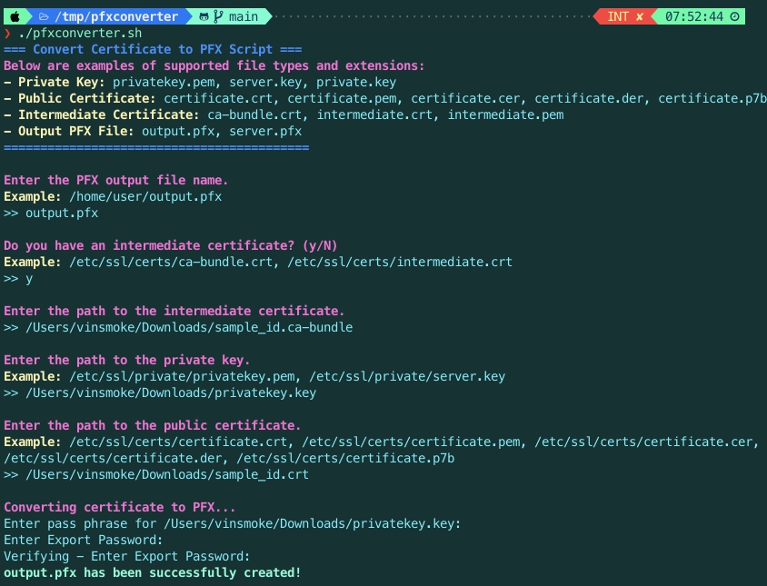
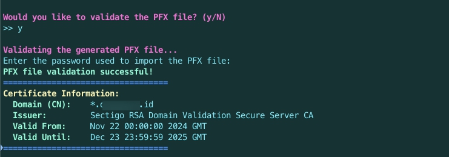

# Convert Certificate to PFX Script

This script converts a private key and public certificate (with an optional intermediate certificate) into a PFX file. It uses OpenSSL for conversion and validation of the resulting PFX file.

## Features
- Supports multiple certificate file formats:
  - **Private Key**: `.pem`, `.key`
  - **Public Certificate**: `.crt`, `.pem`, `.cer`, `.der`, `.p7b`
  - **Intermediate Certificate** (optional): `.crt`, `.pem`
- Validates the resulting PFX file.
- Highlights errors if any step fails.

## Requirements
- Bash shell (Linux/MacOS) or WSL (Windows Subsystem for Linux).
- OpenSSL installed:
    ```bash
    openssl version
    ```

## Installation
1. Clone this repository:
    ```bash
    git clone https://github.com/rdoix/pfxconverter.git
    cd pfxconverter
    ```

## Usage
Run the script with the following command:
```bash
./pfxconverter.sh
```

Follow the prompts to provide:
- PFX output file name.
- Paths to private key, public certificate, and intermediate certificate (optional).

## Example Output

### Input Prompts



### Validation Output



## Notes
- If any step fails, the script will display an error message.
- Ensure that paths to the certificate files are correct and accessible.

## License
This project is licensed under the [MIT License](LICENSE).
